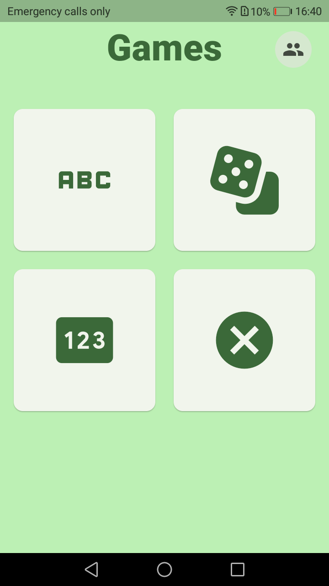
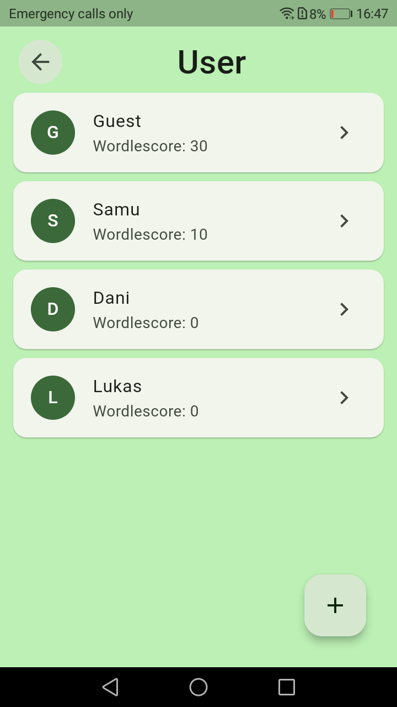
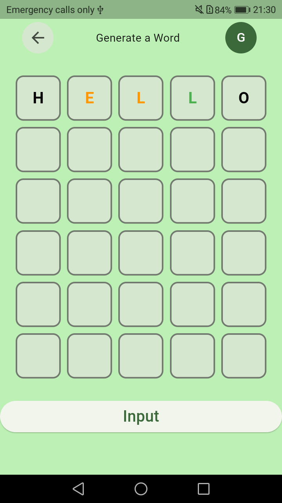
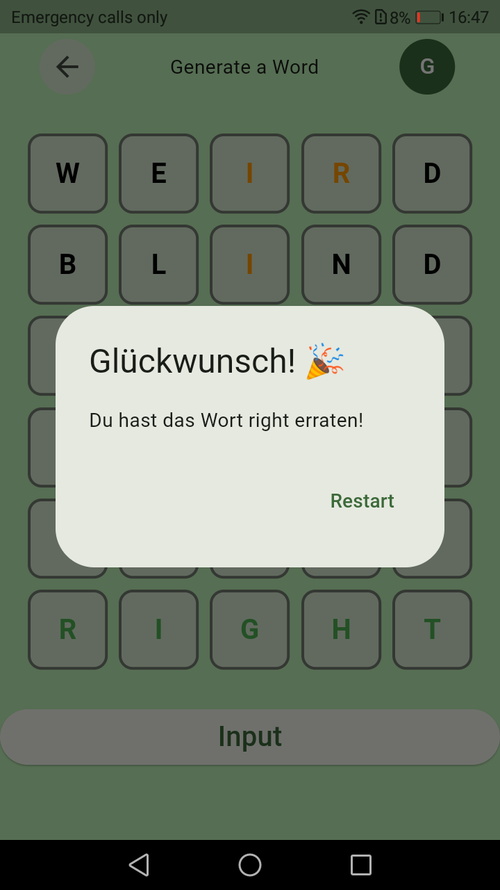
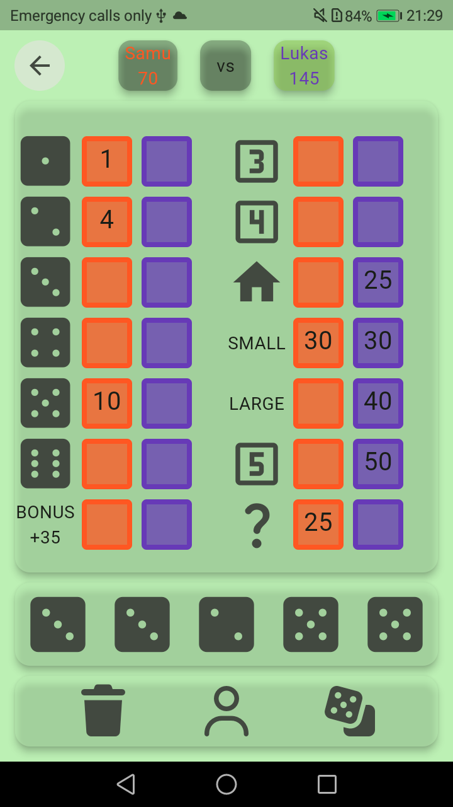
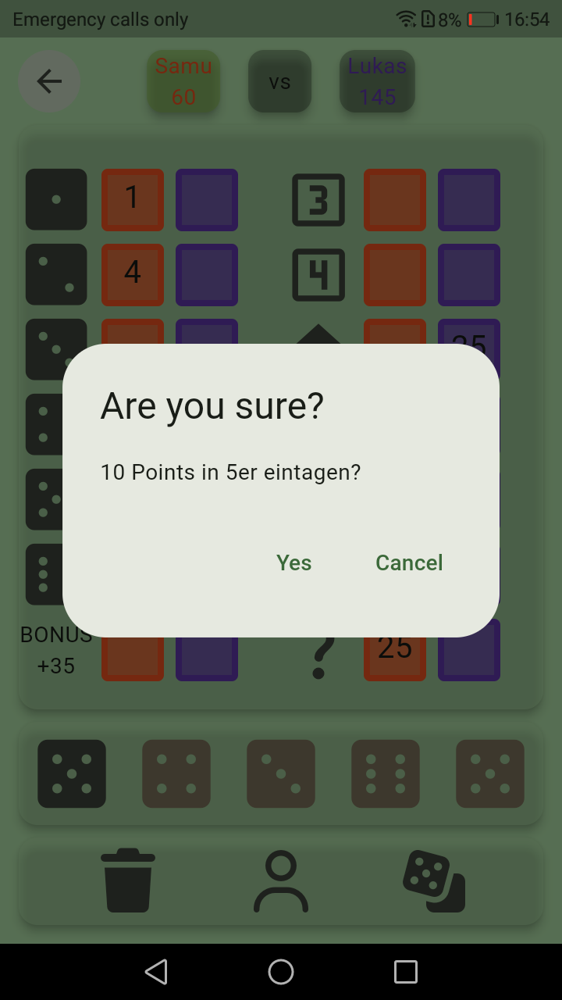

# Mein erstes Flutter App  
von Samuel Schmücker

Die App soll eine Zusammenstellung von verschiedenen Logic-Spielen sein

## Wordle
Wordle ist meine Erste versuchsseite, die aus dem Ursprung des Google Codlaps "ErsteApp"  entsprungen ist dort gab es erstmal nur zufallswörter. Dadurch ist dann die Idee des Wordles entstanden, dies habe ich dann selbstständig umgestezt und auch mit speicherungen der Benutzer und deren Zugehörgen scores zu speichern mitels `sqflite`. Alle neuen Funktionen sind so weit wie möglich eigenstädig programmiert. Die Grundsätzliche Funkion von methoden und Dart-Logik habe ich mir mithilfe von Recherche eigenständig erarbeitet.

## Kniffel
Das Kniffel Spiel ist selbständig entwicklet und kommplet eigenständig programmiert. Hier habe ich versucht alle vorher bekanten Methoden selbsändig um bzw. neu zu schreiben ohne zusätzliche hilfen zu nutzen.

## Roadmap 
Als nächstes habe ich vor ein Hangman-Spiel zu programmiern hierzu werde ich mich eigenständig in `CustomPaint` einarbeiten. Die idee hierfür kommt aus einer Schul-Aufgabe in der es darum ging Hangman in Python mittels tkInter und einem canvas zu programieren. 

<table>
  <tr>
    <td align="center"><b>Menue</b></td>
    <td align="center"><b>Users</b></td>
  </tr>
  <tr>
    <td></td>
    <td></td>
  </tr>
</table>
<table>
  <tr>
    <td colspan= "2" align="center"><b>Wordle</b></td>
  </tr>
  <tr>
    <td></td>
    <td></td>
  </tr>
</table>
<table>
  <tr>
    <td colspan= "2" align="center"><b>Kniffel</b></td>
  </tr>
  <tr>
    <td></td>
    <td></td>
  </tr>
</table>